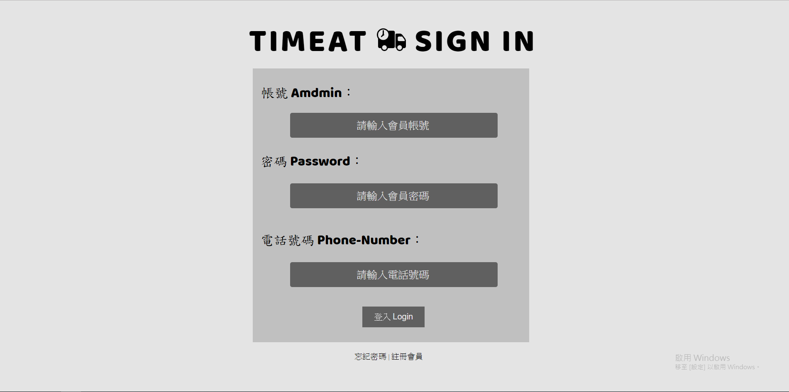
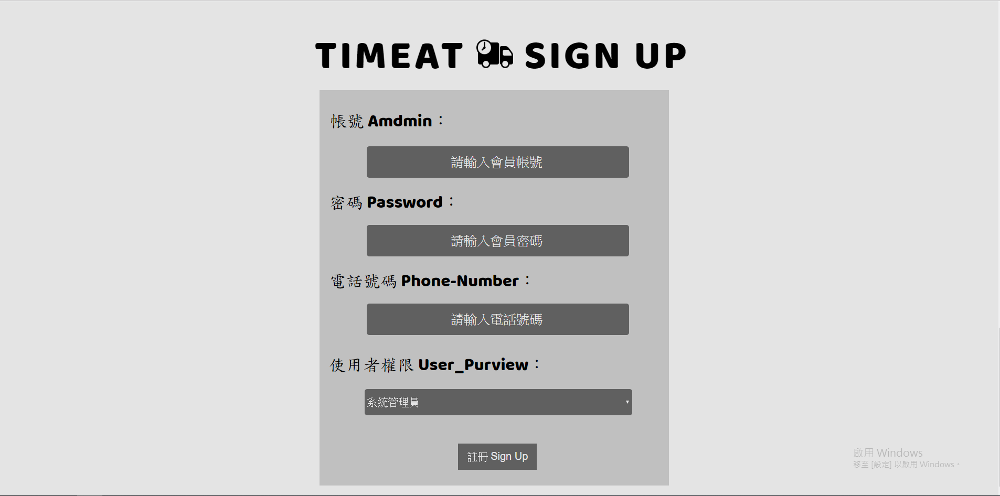
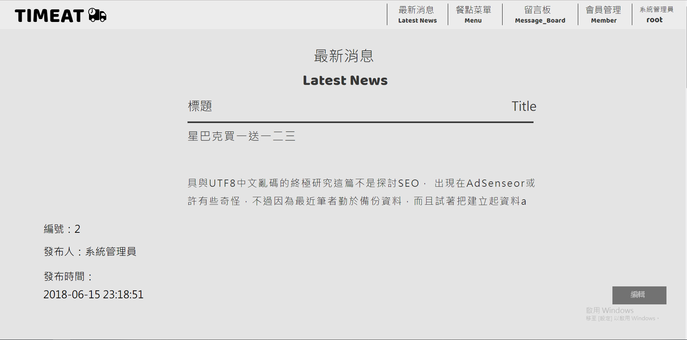
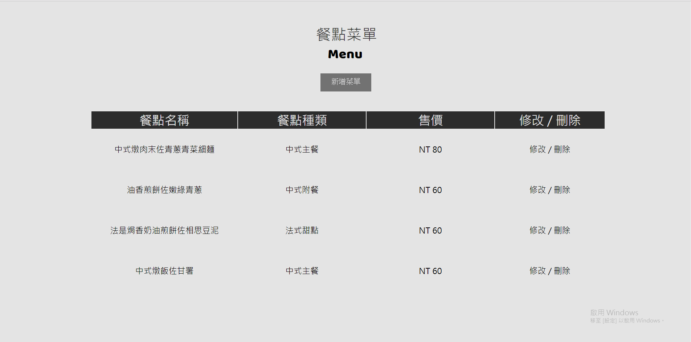
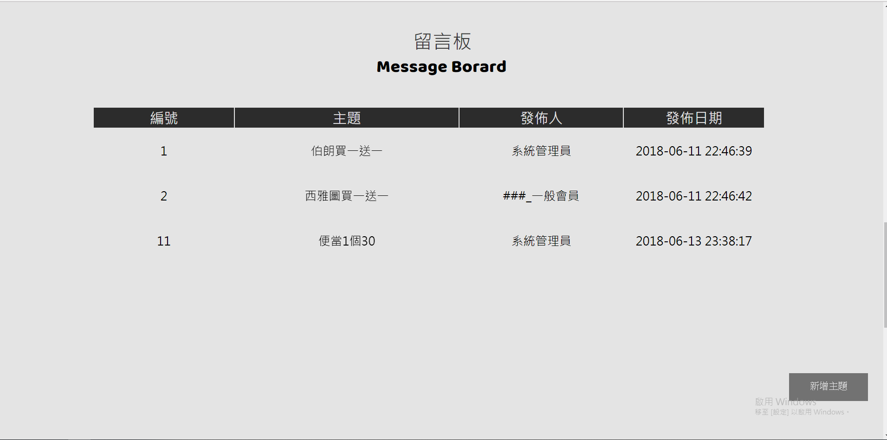
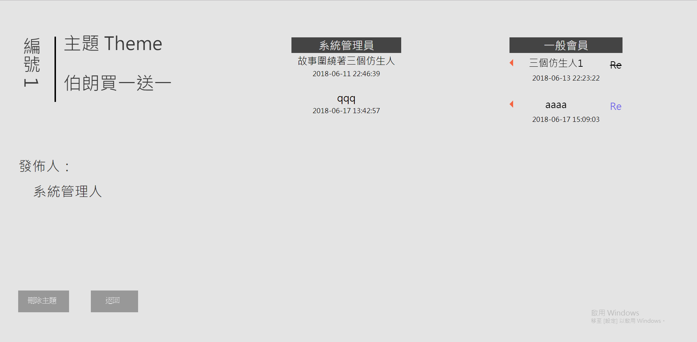
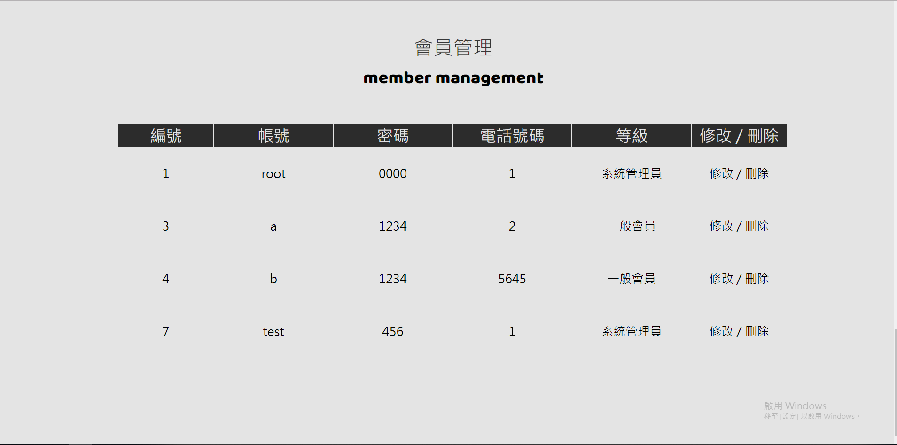
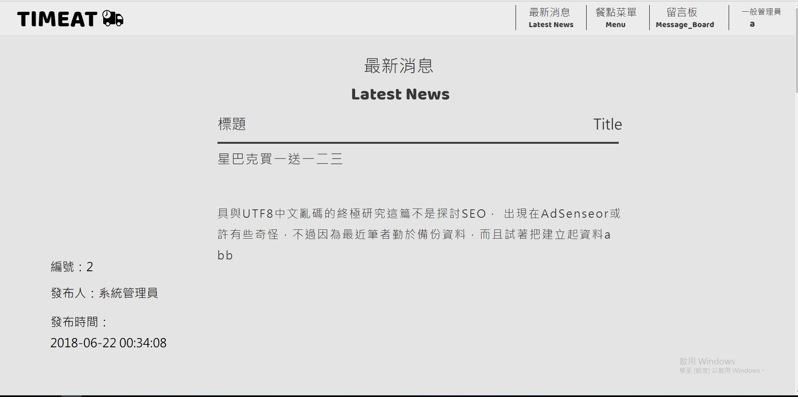
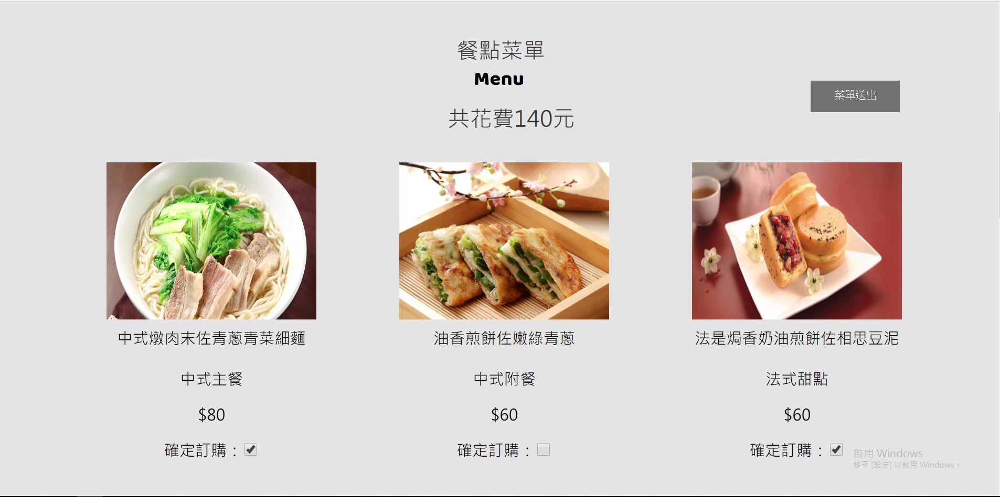
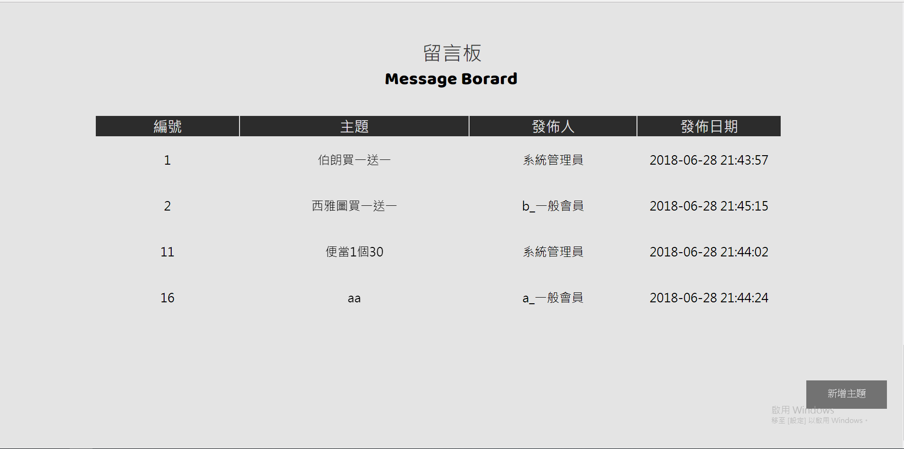

# Web_Order_System
107大數據期末作業 
製作一個簡易點餐會員系統
# 環境
開發環境為`Visual Studio Code` 
伺服器`xampp` 
資料庫`phpmyadmin`
# 螢幕解析度
1920*1080
# 會員帳密
|使用者|帳號|密碼|電話|
|----|----|-----|-----|
|系統管理員|root|0000|1|
|一般會員|a|12334|2|

# 功能
* [首頁](#首頁)
* [會員登入](#會員登入)
* [會員註冊](#會員註冊)
* [系統管理員](#系統管理員)
    * [最新消息](#最新消息)
	* [餐點菜單](#餐點菜單)
	* [留言板](#留言板)
	* [會員管理](#會員管理)
* 一般會員
    * [最新消息](#最新消息1)
	* [餐點菜單](#餐點菜單1)
	* [留言板](#留言板1)
___

### 首頁

### 會員登入

### 會員註冊

## 系統管理員

### 最新消息

### 餐點菜單

### 留言板

### 會員管理

## 一般會員

### 最新消息1

### 餐點菜單1

### 留言板1

# Bug
* 網站整體的安全性
* 沒有支援RWD
* 網站採一頁式做法 新增項目一多 會使排版重疊亂掉
* 一般會員 留言板尚未完成
* 一般會員 菜單送出尚未完成